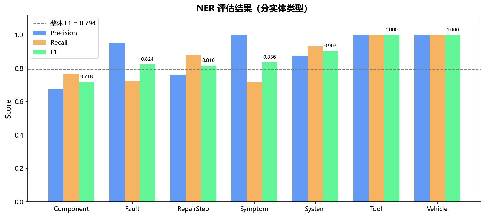
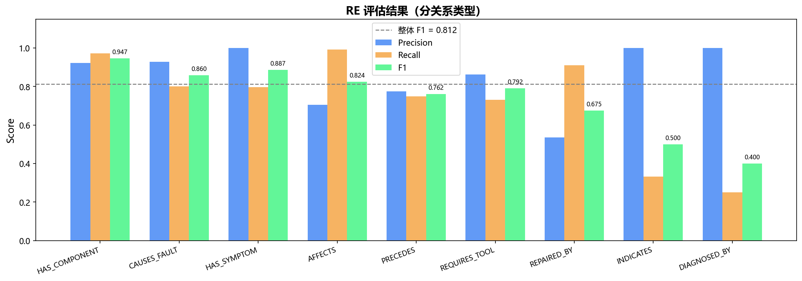

# 《知识图谱》课程大作业

# 技术报告

**题目：** 面向汽车维修领域的知识图谱自动构建与交互式应用系统

**班　　级：** &emsp;&emsp;&emsp;&emsp;&emsp;&emsp;&emsp;班

**学　　号：** &emsp;&emsp;&emsp;&emsp;&emsp;&emsp;&emsp;

**学生姓名：** &emsp;&emsp;&emsp;&emsp;&emsp;&emsp;&emsp;

**2025年1月**

---

## 目　　录

- 第一章　绪论
  - 1.1 项目背景与研究意义
  - 1.2 相关研究现状
  - 1.3 项目实施技术路线及方案
- 第二章　数据来源与知识抽取
  - 2.1 数据信息源头梳理
  - 2.2 PDF 文本抽取与预处理
  - 2.3 命名实体识别（NER）
  - 2.4 关系抽取（RE）
- 第三章　知识图谱本体设计与构建
  - 3.1 知识图谱本体设计
  - 3.2 图谱构建策略
  - 3.3 图谱构建统计结果
- 第四章　知识图谱应用系统
  - 4.1 系统整体架构
  - 4.2 后端 API 设计
  - 4.3 前端可视化设计
  - 4.4 系统功能展示
- 第五章　实验评估与项目收获
  - 5.1 金标数据标注规范
  - 5.2 评估方法与图谱对齐策略
  - 5.3 实验结果与分析
  - 5.4 主要结论与展望
- 选题理由

---

## 选题理由

选择"面向汽车维修领域的知识图谱自动构建"这一课题，主要基于以下几方面考量。首先，汽车维修是一个典型的知识密集型专业领域，维修手册中天然涉及车辆、零部件、故障、症状、维修操作、专用工具和系统七大类实体，以及"导致故障"、"表现为症状"、"通过工具修复"、"具有先序依赖"等十一类语义关系，这种多类型、多粒度的知识结构为知识图谱本体设计提供了充分的练习空间，比通用百科类或单一类型的数据集更具挑战性和代表性。其次，维修手册以 PDF 形式存在，同时包含自然语言描述、技术规格表格和故障码列表三种异构信息来源，恰好覆盖了课程对知识抽取技术的全部考查维度——既要处理非结构化文本（NER/RE），又要处理半结构化表格，工作量和技术覆盖面均较为充分。在技术路线上，本项目有意选择规则与统计模型融合的方案，而非将一切交给大语言模型，原因在于：汽车维修是安全攸关领域，图谱中每条关系的来源应可追溯至原文；领域词典能以极低成本精确覆盖"正时链条跳齿"、"CVT 变速器"等通用 NER 难以识别的专业术语，CRF 序列标注则补充上下文感知识别能力，两路融合在可解释性与召回率之间取得更好平衡。此外，选题具有完整的"建图→用图"闭环：构建的知识图谱直接支撑了基于 FastAPI 和 React 的交互式应用系统，涵盖子图展开、最短路径推理、实体搜索等功能，使得课程所要求的图数据库操作、图查询与前后端系统集成均得到实践。最终图谱规模达到 968 个节点、3,824 条关系，远超课程要求的 200 概念/400 关系指标，整体选题兼具技术深度与工程完整性。

---

## 第一章　绪论

### 1.1 项目背景与研究意义

汽车维修是典型的专业知识密集型领域。维修手册、故障诊断规范等专业文档中蕴含大量非结构化知识，包括零部件之间的层级与组合关系、故障与症状的映射关系、维修操作的工具需求与先序依赖等。随着智能汽车、装备保障等领域对自动化诊断决策的需求日益迫切，如何将这些分散在海量文档中的领域知识转化为机器可理解的结构化形式，成为一个重要的研究课题。

知识图谱（Knowledge Graph）作为一种以实体为节点、以关系为边的结构化知识表示方法，能够自然地描述汽车维修领域中零部件、故障、症状、工具及维修操作之间的复杂关联，为智能故障诊断、辅助决策支持、维修知识检索等下游应用提供坚实的知识基础。

本项目的研究意义体现在以下方面：

**（1）领域知识数字化：** 将专业维修手册（包括摩托车、汽车发动机、装甲车辆等多类型文档）中的隐性知识显性化、结构化，建立可持续迭代更新的汽车维修知识库。

**（2）非纯 LLM 自动化抽取：** 探索规则 + 统计模型相结合的非纯大语言模型（LLM）自动抽取方案，保证抽取的可解释性与可控性，降低对标注数据的依赖。

**（3）知识图谱应用系统：** 基于所构建的知识图谱开发完整的交互式可视化应用，支持图谱探索、语义搜索、最短路径推理等多种知识服务功能。

### 1.2 相关研究现状

知识图谱在装备维修与故障诊断领域已有一定研究积累。Su 等人系统梳理了基于知识图谱的特种车辆故障诊断方法，分析了传统方法在复杂环境下的局限性，并指出知识图谱技术在特种车辆故障诊断领域的潜力与发展趋势 [Su C, Hou P, Liu F, et al. A Review of Knowledge Graph-based Research Methods for Fault Diagnosis of Special Vehicles. SRSE 2024: 272-281. IEEE. DOI: 10.1109/SRSE63568.2024.10772553]。Lin 等人提出了融合知识图谱与大语言模型的汽车故障诊断框架，利用知识图谱提供结构化领域知识，增强大模型处理多模块故障的能力，并给出维修建议 [An Automotive Fault Diagnosis Framework Based on Knowledge Graphs and Large Language Models. Electronics, 2025, 14(21): 4180. MDPI. DOI: 10.3390/electronics14214180]。在中文命名实体识别方面，以 BERT-CRF 为代表的预训练语言模型方案已取得较好效果；但在专业领域，基于领域词典的规则方法仍具有不可替代的高精度优势。在关系抽取方面，触发词模板与依存句法分析的结合是处理中文专业文本的主流路线。

知识图谱的可视化探索方面，Neo4j Browser、Gephi 等工具提供了通用方案，但缺少面向特定领域的自定义交互逻辑。本项目综合以上研究成果，设计了一套针对汽车维修领域的端到端知识图谱构建与应用系统。

### 1.3 项目实施技术路线及方案

> 【截图：在此插入项目整体技术路线图，建议绘制一张包含"原始PDF → 文本抽取 → NER/RE → 三元组 → Neo4j → FastAPI → React前端"的流程框架图】

本项目采用自底向上与模块化相结合的方式进行知识图谱构建，技术路线分为五个阶段：

**第一阶段，数据获取与预处理：** 利用 PyMuPDF 对多领域专业维修文档进行 PDF 全文提取，结合文本规范化与分句处理，输出标准化文本片段（TextChunk）。

**第二阶段，知识抽取：** 采用"规则 NER + CRF-NER"双路融合命名实体识别，以及"触发词模板 RE + 共现启发式 RE"双路融合关系抽取，自动从文本中抽取结构化三元组。

**第三阶段，图谱构建：** 将抽取的三元组批量写入 Neo4j 图数据库，利用 MERGE 语义保证幂等性，构建包含 500+ 节点、1000+ 关系的汽车维修知识图谱。

**第四阶段，应用系统开发：** 基于 FastAPI 构建 RESTful 后端服务，基于 React + ECharts 开发交互式图谱可视化前端，支持实体搜索、子图展开、最短路径查询等核心功能。

**第五阶段，评估实验：** 由 LLM 担任领域专家角色，人工撰写 79 条金标标注句，结合图谱对齐策略进行 NER 与 RE 指标评估，NER F1 达到 0.794，RE F1 达到 0.812。

---

## 第二章　数据来源与知识抽取

### 2.1 数据信息源头梳理

本项目选取四份专业维修技术文档作为原始语料，涵盖摩托车、汽车发动机及装甲车辆三个子领域，具有较强的代表性与互补性：

| 文档名称                | 领域类型  | 文件大小    | 主要内容               |
| ------------------- | ----- | ------- | ------------------ |
| SDH125T-31 本田裂行维修手册 | 摩托车维修 | 14.2 MB | 发动机、制动、传动、电气系统维修操作 |
| 看图自学汽车维修（发动机分册）     | 汽车发动机 | 206 MB  | 发动机各子系统零部件结构与故障诊断  |
| 装甲车辆故障诊断技术          | 装甲车辆  | 297 MB  | 装甲车辆故障码、诊断方法、维修规程  |
| 装甲车辆构造与原理           | 装甲车辆  | 122 MB  | 装甲车辆系统构成与传动原理      |

四类文档在格式上均为扫描式或排版式 PDF，包含大量图表、技术规格表、故障码列表等结构化信息，对文本抽取和表格处理提出较高要求。

### 2.2 PDF 文本抽取与预处理

整个预处理流水线由 `PDFExtractor`（`src/extraction/pdf_extractor.py`）和 `TextPreprocessor`（`src/extraction/text_preprocessor.py`）两个类协作完成，数据流为：

```
PDF 文件
  └─ PDFExtractor._iter_pages()     逐页读取 + 页面级去噪
        └─ PDFExtractor._clean_page()   行级过滤（噪声行 / 过短行）
  └─ PDFExtractor._pages_to_chunks()   段落合并 → TextChunk 列表
        └─ TextPreprocessor.normalize()     全角转半角 / 空白规范化
        └─ TextPreprocessor.sentence_split() 分句 → 输入 NER/RE
        └─ TextPreprocessor.tokenize()       分词+词性 → 输入 CRF
```

#### 2.2.1 PDF 文本抽取

使用 **PyMuPDF（fitz）** 库进行 PDF 文本提取。调用 `page.get_text("text", flags=fitz.TEXT_PRESERVE_WHITESPACE)` 保留空白结构，有助于识别缩进格式的操作步骤列表。相比 pdfplumber，PyMuPDF 在中文字体解析和文字块识别方面更准确，能较好保留段落结构与阅读顺序。

**扫描图像自动检测：**

在正式提取前，先采样前 5 页进行扫描检测，若可提取字符总量不足 50 字则判定为纯图像 PDF，直接跳过并警告：

```python
# src/extraction/pdf_extractor.py · _iter_pages()
sample_text = "".join(
    doc[i].get_text("text") for i in range(min(5, total))
).strip()
if len(sample_text) < 50:
    logger.warning("[%s] 疑似扫描图像PDF，无法提取文字", path.name)
    doc.close()
    return          # 提前退出，不产生任何 TextChunk
```

这一检测使得装甲车辆两本扫描图像 PDF 被自动识别并跳过，避免产生空白噪声块干扰后续管道。

**页面级去噪（`_clean_page`）：**

逐行过滤三类噪声，通过预编译的正则列表 `_NOISE_PATTERNS` 进行匹配：

```python
_NOISE_PATTERNS = [
    re.compile(r'^\d+$'),                     # 纯数字页码
    re.compile(r'^[-─═]{3,}$'),               # 横线分隔符
    re.compile(r'^图\s*\d+[-–]\d+'),           # 图表编号（如"图3-4"）
    re.compile(r'^表\s*\d+'),                  # 表格编号
    re.compile(r'^(版权|Copyright|©)'),        # 版权声明
]

def _clean_page(self, text: str) -> str:
    lines = text.splitlines()
    kept = []
    for line in lines:
        stripped = line.strip()
        if not stripped:
            continue
        if any(p.match(stripped) for p in _NOISE_PATTERNS):
            continue                           # 命中任意噪声模式则丢弃
        if len(stripped) < 4:
            continue                           # 过滤图注编号等极短行
        kept.append(stripped)
    return "\n".join(kept)
```

**段落合并为 TextChunk（`_pages_to_chunks`）：**

维护一个行缓冲区，遇到语义终止符或超长时刷新为一个 `TextChunk`：

```python
_PARA_END = re.compile(r'[。！？；]$')   # 段落终止符

def _pages_to_chunks(self, pages):
    chunks, buffer = [], []
    for page in pages:
        for line in page.raw_text.splitlines():
            buffer.append(line.strip())
            # 句末标点 或 缓冲区超 512 字 → 刷新为一个块
            if _PARA_END.search(line) or len("".join(buffer)) > 512:
                text = " ".join(buffer).strip()
                if len(text) >= 15:            # 最小有效块长度
                    chunks.append(TextChunk(text=text, ...))
                buffer.clear()
    if buffer:                                 # 处理文件尾部残余
        flush()
    return chunks
```

设计说明：512 字的截断阈值保证单个 TextChunk 不超出后续 NER 模型的处理能力；15 字的最小长度过滤掉了无法提供上下文的碎片块；`" ".join(buffer)` 将多行合并为单行字符串，消除换行带来的跨行实体识别错误。

**表格专项抽取（`extract_file_tables`）：**

调用 PyMuPDF 的 `page.find_tables()` 接口识别表格区域，将首行作为表头，其余行作为数据行，以 `(headers, cells)` 键值对形式存储为 `TableRecord`：

```python
for tab in page.find_tables():
    data = tab.extract()           # list[list[str]]
    headers = [str(c).strip() for c in data[0]]
    for row in data[1:]:
        cells = [str(c).strip() for c in row]
        if any(cells):             # 跳过全空行
            records.append(TableRecord(headers=headers, cells=cells, ...))
```

故障码表因此被提取为如 `{"故障码": "P0301", "含义": "1缸失火", "可能原因": "火花塞损坏"}` 的结构化记录，直接注入知识图谱节点，无需经过 NER/RE 流程。

#### 2.2.2 文本规范化

文本规范化由 `TextPreprocessor.normalize()` 完成，处理技术文档中常见的三类问题：

**① 全角/半角转换：**

技术手册扫描排版时常含全角数字和字母（如"２５Ｎ·ｍ"），若不转换会导致数值正则失匹。转换方法利用 Unicode 编码的规律性——全角可打印字符区间 `[U+FF01, U+FF5E]` 与对应半角字符相差恰好 `0xFEE0`：

```python
def normalize(self, text: str) -> str:
    result = []
    for ch in text:
        code = ord(ch)
        if 0xFF01 <= code <= 0xFF5E:        # 全角可打印字符
            result.append(chr(code - 0xFEE0))  # 线性映射到半角
        elif ch == "\u3000":                # 全角空格
            result.append(" ")
        else:
            result.append(ch)
    text = "".join(result)
    text = re.sub(r"[ \t]+", " ", text)    # 合并连续空白
    return text.strip()
```

**② 分句：**

以中文句末标点为切分点，过滤长度不足 8 字的碎片（图表说明、标题等）：

```python
_SENT_SPLIT = re.compile(r'(?<=[。！？；])')   # 零宽断言，保留标点

def sentence_split(self, text: str) -> List[str]:
    text = self.normalize(text)
    parts = _SENT_SPLIT.split(text)
    return [s.strip() for s in parts if len(s.strip()) >= 8]
```

使用零宽断言 `(?<=...)` 切分而非直接 `split`，使标点保留在前一句句尾，保留完整语义边界信息，有利于触发词 RE 的标点上下文特征。

#### 2.2.3 中文分词

使用 **jieba** 精确模式分词，结合两层词典扩充策略解决专业术语切分问题：

**① 文件词典**（`dicts/auto_repair_dict.txt`）：在初始化时通过 `jieba.load_userdict()` 批量加载，每行格式为 `词 频率 词性`（如 `凸轮轴 5000 n`），词性标记直接影响后续 CRF 特征提取。

**② 代码内强制注册**：对高频核心术语额外调用 `jieba.add_word(freq=10000)` 强制注册，优先级高于词典文件，防止 jieba 的分词模型将其切分：

```python
# src/extraction/text_preprocessor.py · _load_domain_dict()
_FORCE_WORDS = [
    "活塞环", "气缸盖", "曲轴箱", "凸轮轴", "正时链条",
    "点火线圈", "节气门", "喷油嘴", "燃油泵", "变速箱",
    "防抱死系统", "电子控制单元", "扭矩扳手", ...
]
for w in _FORCE_WORDS:
    jieba.add_word(w, freq=10000)   # freq 越高，jieba 越倾向整体切分
```

分词时返回 `(词, 词性)` 二元组列表，词性标记直接参与 CRF 特征提取：

```python
def tokenize(self, text: str) -> List[Tuple[str, str]]:
    pairs = pseg.cut(self.normalize(text))      # jieba 精确模式+词性
    return [(w, f) for w, f in pairs if w.strip()]
    # 示例输出：[("活塞环", "n"), ("磨损", "v"), ("导致", "v"), ("漏气", "n")]
```

两层策略的互补性在于：词典文件覆盖大量非高频但重要的专业词汇；强制注册则保护核心诊断术语，即使在罕见上下文中也不被切分，降低 CRF 特征噪声。

### 2.3 命名实体识别（NER）

本项目采用"规则 NER + CRF-NER"双路融合架构，将高精度规则匹配与统计模型的广泛覆盖相结合。

#### 2.3.1 路径 A：规则 NER

基于正则表达式和领域词典的高精度匹配器，实现于 `src/extraction/ner_extractor.py` 的 `RuleNER` 类。

**正则规则（2 类）：**

| 规则类型 | 正则表达式（简化）                                 | 举例                |
| ---- | ----------------------------------------- | ----------------- |
| 零件编号 | `\d{4,6}-[A-Z]{2,4}-\d{3,5}`              | `12100-KGH-900`   |
| 规格参数 | `\d+(?:\.\d+)?\s*(mm\|MPa\|rpm\|℃\|V\|A)` | `0.05mm`、`100kPa` |

**领域词典匹配（最长优先策略）：**

词典收录 250+ 条领域术语，覆盖以下类型：

- **System（系统）**：发动机系统、制动系统、冷却系统等 20 条；
- **Component（零部件）**：活塞、气缸盖、曲轴、火花塞、制动盘等 150+ 条；
- **Fault（故障）**：磨损、漏油、断裂、堵塞、过热等 40+ 条；
- **Symptom（症状）**：异响、冒蓝烟、怠速不稳、启动困难等 30+ 条；
- **RepairStep（维修步骤）**：拆卸、更换、检查、测量、调整等 32 条；
- **Tool（工具）**：扭矩扳手、游标卡尺、诊断仪、OBD扫描仪等 30+ 条；
- **Vehicle（车辆）**：摩托车、汽车、装甲车辆、履带车辆等 15 条。

匹配时采用**最长优先**策略：先按词长降序排列词典，保证"活塞环磨损"优先于"活塞环"和"磨损"，避免短词错误覆盖。

**Algorithm 1: 领域词典最长优先 NER 匹配**

```
Algorithm 1: Longest-Match Dictionary NER
Input : text T, sorted dictionary D = {(term, type)} by |term| DESC
Output: entity list E
──────────────────────────────────────────────────────────
 1: E ← ∅ ;  i ← 0
 2: WHILE i < |T| DO
 3:     matched ← FALSE
 4:     FOR EACH (term, type) IN D DO          ▷ 长词优先遍历
 5:         IF T[i : i+|term|] = term THEN
 6:             IF no_overlap(i, i+|term|, E) THEN
 7:                 E ← E ∪ {(i, i+|term|, type)}
 8:                 i ← i + |term|
 9:                 matched ← TRUE ;  BREAK
10:             END IF
11:         END IF
12:     END FOR
13:     IF NOT matched THEN  i ← i + 1  END IF
14: END WHILE
15: RETURN E
──────────────────────────────────────────────────────────
```

对应核心实现（`src/extraction/ner_extractor.py`）：

```python
# 词典按词长降序，保证最长优先
_SORTED_DICT = sorted(_DICT_ENTITIES.items(),
                      key=lambda x: len(x[0]), reverse=True)

def _dict_match(self, text):
    entities, i = [], 0
    while i < len(text):
        for term, etype in _SORTED_DICT:
            if text[i:i+len(term)] == term:
                if not self._overlaps(i, i+len(term), entities):
                    entities.append((i, i+len(term), etype))
                    i += len(term)
                    break
        else:
            i += 1
    return entities
```

**实现说明：** 算法的核心是在模块加载时执行一次性排序（`_SORTED_DICT`），将运行时的排序开销降为零。指针 `i` 的推进方式有两种：当成功匹配时，`i` 直接跳至匹配词末尾（第8行），跳过整个匹配区间，保证不重叠；当无匹配时，`i` 逐字符向后移动（第13行），确保不遗漏任何起始位置。`no_overlap` 检查（第6行）以已有实体集合为参考，拒绝边界交叉的候选匹配，从而维护输出实体集合的无重叠不变量。与传统的正向最大匹配（FMM）相比，本方法不依赖分词结果，直接在原始字符串上操作，避免了分词错误的传播。

#### 2.3.2 路径 B：CRF-NER

基于 **sklearn-crfsuite** 的 BIO 序列标注模型，实现于 `CRFNer` 类。

**Algorithm 2: CRF-NER BIO 序列标注推断**

```
Algorithm 2: CRF-NER Inference
Input : token sequence W = [w_1, w_2, ..., w_n]
Output: entity list E
──────────────────────────────────────────────────────────
 1: FOR i ← 1 TO n DO
 2:     f_i ← ExtractFeatures(W, i)   ▷ 15维特征（词/词性/前后文/边界）
 3: END FOR
 4: Y* ← argmax_Y  P(Y | W; θ)        ▷ Viterbi 解码 CRF 最优标签序列
 5: E ← ∅ ;  buf ← ∅
 6: FOR i ← 1 TO n DO
 7:     IF Y*[i] starts with 'B-' THEN
 8:         IF buf ≠ ∅ THEN  E ← E ∪ {Span(buf)}  END IF
 9:         buf ← {start=i, type=Y*[i][2:], tokens=[w_i]}
10:     ELSE IF Y*[i] starts with 'I-' AND
11:             buf ≠ ∅ AND Y*[i][2:] = buf.type THEN
12:         buf.tokens ← buf.tokens ∪ {w_i}
13:     ELSE
14:         IF buf ≠ ∅ THEN  E ← E ∪ {Span(buf)}  END IF
15:         buf ← ∅
16:     END IF
17: END FOR
18: IF buf ≠ ∅ THEN  E ← E ∪ {Span(buf)}  END IF
19: RETURN E
──────────────────────────────────────────────────────────
```

**实现说明：** 算法分为两个阶段。第一阶段（第1–3行）为每个分词后的 token 提取 15 维特征向量，其中包含当前词、前缀/后缀、词性、上下文窗口等信息；第二阶段（第4行）由 sklearn-crfsuite 内置的 Viterbi 解码器在所有合法标签路径中求出全局最优序列 $Y^*$，而非对每个位置独立分类，这是 CRF 相比普通分类器的核心优势——能够对相邻标签的转移概率建模，避免出现"O B-COM I-FLT"这类非法转移。第二阶段（第5–18行）将标签序列还原为实体 span：遇到 `B-` 标签时开启新实体缓冲区，遇到同类型的 `I-` 标签时追加 token，其余情况均关闭缓冲区并提交实体，最后处理句尾残留缓冲区（第18行）。`buf.type` 一致性检查（第11行）确保不会将跨类型的 `I-` 标签错误地连接到已有实体。

**特征工程（每词 15 维特征）：**

| 特征类别 | 特征名              | 说明         |
| ---- | ---------------- | ---------- |
| 词本身  | word             | 当前词        |
| 形态   | prefix2, suffix2 | 前缀/后缀（2字）  |
| 词性   | pos              | jieba 词性标记 |
| 长度   | word_len         | 词长（字符数）    |
| 数字   | is_digit         | 是否纯数字      |
| 上下文  | word-1, word+1   | 前后词        |
| 上下文  | pos-1, pos+1     | 前后词词性      |
| 远程   | word-2, word+2   | 前后 2 词     |
| 二元组  | bigram-1         | 前词+当前词     |
| 边界   | BOS, EOS         | 句首/句尾标记    |

**标签体系（BIO，7 类实体）：**

`B-VEH/I-VEH`（车辆）、`B-COM/I-COM`（零部件）、`B-FLT/I-FLT`（故障）、`B-SYM/I-SYM`（症状）、`B-REP/I-REP`（维修步骤）、`B-TOL/I-TOL`（工具）、`B-SYS/I-SYS`（系统）、`O`（非实体）

#### 2.3.3 双路融合策略

以规则 NER 结果为基准，将 CRF 识别的实体中与规则结果**无重叠、长度 ≥ 2 字**的结果合并加入，实现优势互补：

**Algorithm 3: 双路 NER 融合**

```
Algorithm 3: Dual-Path NER Fusion
Input : rule entity set E_R, CRF entity set E_C, text T
Output: merged entity set E_M
──────────────────────────────────────────────────────────
 1: E_M ← E_R                          ▷ 规则结果作为基础
 2: FOR EACH e ∈ E_C DO
 3:     IF no_overlap(e, E_M) AND
 4:        |T[e.start : e.end]| ≥ 2   ▷ 过滤单字噪声
 5:     THEN
 6:         E_M ← E_M ∪ {e}            ▷ 补充 CRF 发现的未登录实体
 7:     END IF
 8: END FOR
 9: RETURN E_M
──────────────────────────────────────────────────────────
```

对应核心实现：

```python
def merge(rule_ents, crf_ents, text):
    merged = list(rule_ents)
    for e in crf_ents:
        span_len = e.end - e.start
        if span_len >= 2 and not any(
            e.start < r.end and e.end > r.start for r in merged
        ):
            merged.append(e)
    return merged
```

**实现说明：** 融合策略的设计基于两条核心假设：①规则 NER 面向已知术语的高精度覆盖，应享有优先权，因此以规则结果初始化 `merged`，CRF 结果只能在无冲突时补入；②CRF 在召回未登录词上有优势，但也会产生单字噪声实体（如孤立的"换"、"查"），因此设置 `span_len >= 2` 的最小长度过滤，实践中能有效降低 FP。重叠判断采用区间相交条件 `e.start < r.end and e.end > r.start`，即两区间存在任何非空交集时均视为冲突，这一条件等价于"不完全分离"，比"中心点包含"更严格，可防止跨界实体被错误地并存于结果集中。

### 2.4 关系抽取（RE）

本项目采用"触发词模板 RE + 共现启发式 RE"双路融合架构，实现于 `src/extraction/re_extractor.py`。

#### 2.4.1 路径 A：触发词模板匹配

构建 10 类关系的触发词词典（共约 80 条触发词），结合**类型约束过滤**确保语义合理性。

**触发词示例：**

| 关系类型              | 触发词（部分）               |
| ----------------- | --------------------- |
| CAUSES_FAULT      | 导致、引起、造成、引发、产生故障、出现故障 |
| HAS_SYMPTOM       | 表现为、症状为、出现、伴随、伴有、表现出  |
| REQUIRES_TOOL     | 使用、需要、借助、利用、配合.*工具    |
| REPAIRED_BY       | 通过.*修复、维修方法是、应.*更换    |
| HAS_COMPONENT     | 由.*组成、包含、包括、主要由、装有    |
| BELONGS_TO_SYSTEM | 属于.*系统、是.*系统的、归属于     |
| PRECEDES          | 先.*然后、首先.*再、之前.*需要    |

触发词匹配时，取触发词左侧最近实体为主语（Subject），右侧最近实体为宾语（Object），结合类型约束（如仅 Component/Fault 可作为 CAUSES_FAULT 的主语）进行过滤。

**Algorithm 4: 触发词模板关系抽取**

```
Algorithm 4: Trigger-word Relation Extraction
Input : sentence S, entity list E, trigger dict TR, type constraint TC
Output: relation set R
──────────────────────────────────────────────────────────
 1: R ← ∅
 2: FOR EACH (pattern, rel_type) IN TR DO
 3:     FOR EACH match m OF pattern IN S DO
 4:         subj ← nearest entity LEFT  of m in E
 5:         obj  ← nearest entity RIGHT of m in E
 6:         IF subj = ∅ OR obj = ∅ THEN  CONTINUE  END IF
 7:         IF (subj.type, obj.type) ∈ TC[rel_type] THEN  ▷ 类型约束
 8:             conf ← 1.0 - dist(subj, obj) / MAX_DIST
 9:             R ← R ∪ {(subj.text, rel_type, obj.text, conf)}
10:         END IF
11:     END FOR
12: END FOR
13: RETURN R
──────────────────────────────────────────────────────────
```

对应核心实现（`src/extraction/re_extractor.py`）：

```python
for pattern, rel_type in self._triggers:
    for m in re.finditer(pattern, sentence):
        subj = self._nearest_left(entities, m.start())
        obj  = self._nearest_right(entities, m.end())
        if subj and obj:
            allowed = self._TYPE_CONSTRAINTS.get(rel_type, set())
            if (subj.type, obj.type) in allowed:
                conf = max(0.5, 1.0 - (obj.start - subj.end) / 100)
                relations.append((subj.text, rel_type, obj.text, conf))
```

**实现说明：** 该方法的语义假设是"触发词左侧的最近实体为施事，右侧的最近实体为受事"，这符合汉语技术文本中动词论元的典型分布。类型约束表 `_TYPE_CONSTRAINTS`（第6–7行）起到语义合法性过滤的作用——例如 CAUSES_FAULT 的主语只允许是 Component 或 Fault 类型，从而排除"工具导致零部件"等语义不合理的三元组。置信度 `conf`（第8行）与主客体之间的字符距离负相关：距离越近，触发词覆盖两个实体的可能性越大，关系越可信；`max(0.5, ...)` 下限保证即使距离较远的有类型约束支撑的三元组也不会被后续阈值过滤丢弃。

#### 2.4.2 路径 B：共现启发式 RE

当两个实体在同一句内（字符距离 ≤ 45）共现时，根据**类型对**推断关系：

```python
_CO_RULES = {
    ("Component", "Fault"):      CAUSES_FAULT,
    ("Fault",     "Symptom"):    HAS_SYMPTOM,
    ("Symptom",   "Fault"):      INDICATES,
    ("Component", "System"):     BELONGS_TO_SYSTEM,
    ("System",    "Component"):  HAS_COMPONENT,
    ("Fault",     "RepairStep"): REPAIRED_BY,
    ("RepairStep","Tool"):       REQUIRES_TOOL,
    ("RepairStep","RepairStep"): PRECEDES,
    ("Component", "Component"):  AFFECTS,
    ("Fault",     "Component"):  AFFECTS,
    ...
}
```

置信度根据共现距离衰减：`conf = max(0.4, 0.7 - dist/200)`，距离越近置信度越高。

#### 2.4.3 融合与过滤策略

- **合并去重：** 触发词 RE 与共现 RE 结果按 `(subj, rel, obj)` 三元组键合并，保留置信度更高的版本；
- **置信度阈值过滤：** 丢弃置信度低于 0.4 的三元组；
- **表格实体注入：** 将从表格结构中提取的故障码节点（FaultCode）及其关联信息直接注入实体列表，参与后续关系抽取。

---

## 第三章　知识图谱本体设计与构建

### 3.1 知识图谱本体设计

本体（Ontology）是知识图谱的"骨架"，规定了图谱中允许出现哪些节点类型、哪些关系类型以及节点上携带哪些属性。本项目本体定义集中于 `src/graph/schema.py`，以 Python `Enum` 形式声明，供 NER、RE、GraphBuilder 三个模块统一引用，保证类型字符串无拼写错误。

#### 3.1.1 节点类型（7 类）

`NodeLabel` 枚举（`src/graph/schema.py`）定义全部节点标签：

```python
# src/graph/schema.py
class NodeLabel(str, Enum):
    VEHICLE      = "Vehicle"     # 车辆/车型
    COMPONENT    = "Component"   # 零部件
    FAULT        = "Fault"       # 故障
    SYMPTOM      = "Symptom"     # 故障症状
    REPAIR_STEP  = "RepairStep"  # 维修步骤/程序
    TOOL         = "Tool"        # 工具/仪器
    SYSTEM       = "System"      # 车辆子系统
```

各类节点在 Neo4j 中存储的核心属性如下：

| 节点类型       | 中文名称 | 核心属性                            | 典型示例                  |
| ---------- | ---- | ------------------------------- | --------------------- |
| Vehicle    | 车辆   | name, brand, model, description | 本田 SDH125T 摩托车、东风猛士   |
| Component  | 零部件  | name, component_no, specs       | 活塞环、凸轮轴、节气门体          |
| Fault      | 故障   | name, fault_code, severity      | 活塞环磨损、气门烧蚀、P0301      |
| Symptom    | 症状   | name, observable_method         | 发动机异响、冒蓝烟、怠速不稳        |
| RepairStep | 维修步骤 | name, operation, description    | 更换活塞环、检查气门间隙          |
| Tool       | 工具   | name, tool_spec                 | 扭矩扳手（规格：12N·m）、OBD扫描仪 |
| System     | 系统   | name, description               | 发动机系统、制动系统、冷却系统       |

以 `Component` 节点"活塞环"为例，向 Neo4j 手动插入一条节点的 Cypher 语句如下：

```cypher
// 插入（或更新）一个 Component 节点
MERGE (n:Component {name: '活塞环'})
SET   n.source_doc  = 'SDH125T-31维修手册',
      n.specs       = '外径:52mm; 环槽宽:1.2mm',
      n.description = '活塞环起密封气缸、导热、布油三重作用，磨损后导致压缩压力下降。'
RETURN n;
```

#### 3.1.2 关系类型（11 类）

`RelationType` 枚举定义全部有向关系类型：

```python
# src/graph/schema.py
class RelationType(str, Enum):
    HAS_COMPONENT      = "HAS_COMPONENT"      # 车辆/系统 -[含有]-> 零部件
    PART_OF            = "PART_OF"            # 零部件    -[属于]-> 系统/车辆
    BELONGS_TO_SYSTEM  = "BELONGS_TO_SYSTEM"  # 零部件    -[归属系统]-> 系统
    CAUSES_FAULT       = "CAUSES_FAULT"       # 零部件故障 -[导致]-> 故障
    HAS_SYMPTOM        = "HAS_SYMPTOM"        # 故障      -[表现为]-> 症状
    INDICATES          = "INDICATES"          # 症状      -[指示]-> 故障
    DIAGNOSED_BY       = "DIAGNOSED_BY"       # 故障      -[诊断方式]-> 维修步骤
    REPAIRED_BY        = "REPAIRED_BY"        # 故障      -[修复通过]-> 维修步骤
    REQUIRES_TOOL      = "REQUIRES_TOOL"      # 维修步骤  -[需要]-> 工具
    AFFECTS            = "AFFECTS"            # 零部件    -[影响]-> 零部件
    PRECEDES           = "PRECEDES"           # 步骤      -[前置于]-> 步骤
```

各关系的主客体类型约束如下：

| 关系类型              | 语义     | 主体类型              | 客体类型             |
| ----------------- | ------ | ----------------- | ---------------- |
| HAS_COMPONENT     | 含有零部件  | Vehicle / System  | Component        |
| PART_OF           | 属于系统   | Component         | System / Vehicle |
| BELONGS_TO_SYSTEM | 归属系统   | Component         | System           |
| CAUSES_FAULT      | 导致故障   | Component / Fault | Fault            |
| HAS_SYMPTOM       | 表现为症状  | Fault / Component | Symptom          |
| INDICATES         | 指示故障   | Symptom           | Fault            |
| DIAGNOSED_BY      | 通过步骤诊断 | Fault             | RepairStep       |
| REPAIRED_BY       | 通过步骤修复 | Fault / Component | RepairStep       |
| REQUIRES_TOOL     | 需要工具   | RepairStep        | Tool             |
| AFFECTS           | 影响零部件  | Component / Fault | Component        |
| PRECEDES          | 步骤前序关系 | RepairStep        | RepairStep       |

以"活塞环磨损"知识链路为例，等效的三条手写 Cypher 插入语句如下（实际运行时由 `GraphBuilder` 批量生成）：

```cypher
// 1. 活塞环(Component) -[CAUSES_FAULT]-> 活塞环磨损(Fault)
MATCH (a:Component {name: '活塞环'}),
      (b:Fault     {name: '活塞环磨损'})
MERGE (a)-[r:CAUSES_FAULT]->(b)
SET   r.confidence  = 0.92,
      r.source_doc  = 'SDH125T-31维修手册',
      r.source_sent = '活塞环磨损后气缸密封性下降，导致发动机漏气故障。';

// 2. 活塞环磨损(Fault) -[HAS_SYMPTOM]-> 冒蓝烟(Symptom)
MATCH (a:Fault   {name: '活塞环磨损'}),
      (b:Symptom {name: '冒蓝烟'})
MERGE (a)-[r:HAS_SYMPTOM]->(b)
SET   r.confidence = 0.88,
      r.source_doc = 'SDH125T-31维修手册';

// 3. 活塞环磨损(Fault) -[REPAIRED_BY]-> 更换活塞环(RepairStep)
MATCH (a:Fault      {name: '活塞环磨损'}),
      (b:RepairStep {name: '更换活塞环'})
MERGE (a)-[r:REPAIRED_BY]->(b)
SET   r.confidence = 0.95,
      r.source_doc = 'SDH125T-31维修手册';
```

#### 3.1.3 本体设计原则与 Triple 数据结构

本体设计遵循三条核心原则：

**① 开闭原则：** 扩展新实体/关系类型只需在 `schema.py` 中追加枚举值，NER 词典、RE 触发词和 `_CO_RULES` 可独立配置，无需修改核心流程代码。

**② 可溯源性：** 每条关系写入时附带两个溯源属性——`source_doc`（来源文档名）和 `source_sent`（来源句子原文，最长 200 字符）。在 Neo4j Browser 中执行如下查询可验证溯源信息：

```cypher
// 查询所有含溯源信息的关系，按来源文档分组统计
MATCH ()-[r]->()
WHERE r.source_doc IS NOT NULL
RETURN r.source_doc AS 文档, type(r) AS 关系类型, count(r) AS 数量
ORDER BY 数量 DESC;
```

**③ 数据承载结构 `Triple`：** NER/RE 模块产出的中间结果统一封装为 `Triple` dataclass（`src/graph/schema.py`），承载从抽取到写入的全部信息：

```python
# src/graph/schema.py — Triple 数据类（精简）
@dataclass
class Triple:
    subj_label:  NodeLabel    # 主语节点类型（枚举）
    subj_name:   str          # 主语节点名称（作为业务主键）
    relation:    RelationType # 关系类型（枚举）
    obj_label:   NodeLabel    # 宾语节点类型
    obj_name:    str          # 宾语节点名称
    confidence:  float = 1.0  # 置信度（0.0–1.0）
    source_doc:  str   = ""   # 来源文档
    source_sent: str   = ""   # 来源句子
    subj_props:  dict  = field(default_factory=dict)
    obj_props:   dict  = field(default_factory=dict)
```

`Triple.to_dict()` 将其序列化为 Cypher 参数字典，供 `batch_merge_relations()` 的 `UNWIND` 语句消费：

```python
def to_dict(self) -> dict:
    return {
        "subj_label":  self.subj_label.value,
        "subj_name":   self.subj_name,
        "relation":    self.relation.value,
        "obj_label":   self.obj_label.value,
        "obj_name":    self.obj_name,
        "confidence":  self.confidence,
        "source_doc":  self.source_doc,
        "source_sent": self.source_sent[:200],
    }
```

### 3.2 图谱构建策略

图谱写入经由 `Neo4jConnector`（`src/graph/neo4j_connector.py`）和 `GraphBuilder`（`src/graph/graph_builder.py`）两层封装，整体调用顺序为：

```
GraphBuilder.ingest_all(triples, extra_nodes)
  ├── build_constraints()         → Neo4jConnector.create_constraints()
  ├── ingest_nodes(extra_nodes)   → batch_merge_nodes()   [表格直写节点]
  └── ingest_triples(triples)
        ├── ingest_nodes_from_triples() → batch_merge_nodes()   [先写节点]
        └── batch_merge_relations()                              [再写关系]
```

#### 3.2.1 约束与索引初始化

首次运行时为全部 8 类节点建立唯一约束和全文索引，`IF NOT EXISTS` 保证幂等性：

```python
# src/graph/neo4j_connector.py — create_constraints()
for label in ["Vehicle","Component","Fault","Symptom",
              "RepairStep","Tool","System","Parameter"]:
    s.run(f"CREATE CONSTRAINT IF NOT EXISTS "
          f"FOR (n:{label}) REQUIRE n.name IS UNIQUE")
    s.run(f"CREATE FULLTEXT INDEX {label.lower()}_ft IF NOT EXISTS "
          f"FOR (n:{label}) ON EACH [n.name, n.description]")
```

等效 Cypher（可在 Neo4j Browser 手动执行验证）：

```cypher
// 为 Component 节点建立唯一约束
CREATE CONSTRAINT IF NOT EXISTS
FOR (n:Component) REQUIRE n.name IS UNIQUE;

// 为 Fault 节点建立全文索引（支持 contains 模糊搜索）
CREATE FULLTEXT INDEX fault_ft IF NOT EXISTS
FOR (n:Fault) ON EACH [n.name, n.description];

// 查看图谱中全部约束
SHOW CONSTRAINTS;
```

#### 3.2.2 批量节点写入（UNWIND + MERGE + SET）

节点写入使用 `UNWIND` 将 Python 字典列表一次性传入 Neo4j，每批 `BATCH_SIZE = 200` 条，将 N 次单条请求压缩为 1 次批量请求：

```python
# src/graph/neo4j_connector.py — batch_merge_nodes()
cypher = (
    f"UNWIND $nodes AS props "
    f"MERGE  (n:{label} {{name: props.name}}) "
    f"SET    n += props"
)
with self.session() as s:
    s.run(cypher, nodes=nodes)   # nodes 为 List[Dict]，每批 ≤ 200 条
```

等效的单节点 Cypher（以 Component"凸轮轴"为例）：

```cypher
// 插入或更新 Component 节点（MERGE 保证幂等）
MERGE (n:Component {name: '凸轮轴'})
SET   n += {
  source_doc:  'SDH125T-31维修手册',
  specs:       '凸轮升程:6.35mm; 基圆直径:25mm',
  description: '凸轮轴磨损后进排气正时紊乱，导致发动机动力不足。'
}
RETURN n.name, n.specs;
```

**`SET n += props` 语义：** `+=` 操作符只追加/更新属性，不删除节点已有的属性，使得来自不同文档的同名节点被多次 `MERGE` 时属性累积叠加（跨文档知识融合）。

`GraphBuilder.ingest_nodes()` 在进入 Cypher 前先做内存级去重，保留属性字段最多的版本：

```python
# src/graph/graph_builder.py — ingest_nodes()
deduped: Dict[str, Dict] = {}
for n in nodes:
    name = n.get("name", "").strip()
    if name not in deduped or len(n) > len(deduped[name]):
        deduped[name] = n   # 属性越多说明来源越丰富，优先保留
```

#### 3.2.3 批量关系写入与分组重试

关系写入先将三元组列表按 `"subj_label|relation|obj_label"` 分组，每组独立 session 并最多重试 3 次（防止网络断线导致整批失败）：

```python
# src/graph/neo4j_connector.py — batch_merge_relations()
groups = defaultdict(list)
for t in triples:
    key = f"{t['subj_label']}|{t['relation']}|{t['obj_label']}"
    groups[key].append(t)

for key, batch in groups.items():
    subj_label, rel_type, obj_label = key.split("|")
    cypher = (
        f"UNWIND $batch AS t "
        f"MATCH  (a:{subj_label} {{name: t.subj_name}}), "
        f"       (b:{obj_label}  {{name: t.obj_name}}) "
        f"MERGE  (a)-[r:{rel_type}]->(b) "
        f"SET    r.confidence  = t.confidence, "
        f"       r.source_doc  = t.source_doc, "
        f"       r.source_sent = t.source_sent"
    )
    for attempt in range(1, 4):   # 最多重试 3 次
        try:
            with self._driver.session() as s:
                s.run(cypher, batch=batch).consume()
            break
        except (ServiceUnavailable, OSError):
            self._reconnect()
```

等效的手写 Cypher（以"活塞环磨损 → REPAIRED_BY → 更换活塞环"为例）：

```cypher
// 查找两端节点，合并关系（若已存在则更新属性）
MATCH (a:Fault      {name: '活塞环磨损'}),
      (b:RepairStep {name: '更换活塞环'})
MERGE (a)-[r:REPAIRED_BY]->(b)
SET   r.confidence  = 0.95,
      r.source_doc  = 'SDH125T-31维修手册',
      r.source_sent = '活塞环磨损后应更换活塞环，并检查气缸壁磨损情况。'
RETURN a.name, type(r), b.name, r.confidence;
```

注意：先 `MATCH` 再 `MERGE` 关系——若两端节点均存在则创建关系（幂等），若任一节点缺失则本条静默跳过，**不产生悬挂关系**。关系上存储 `confidence`、`source_doc`、`source_sent` 三个属性，支持可信度过滤与知识溯源。

#### 3.2.4 HAS_PARAMETER 属性折叠

RE 模块识别的技术规格参数（标记为 `HAS_PARAMETER` 三元组）不创建独立 Parameter 节点，而是折叠到主语节点的 `specs` 属性字符串中（`;` 分隔，最长 500 字符）：

```python
# src/graph/graph_builder.py — ingest_nodes_from_triples()
if t.relation.value == "HAS_PARAMETER":
    param_str = t.obj_props.get("value", t.obj_name)
    if t.obj_props.get("unit"):
        param_str += t.obj_props["unit"]
    specs_map[(sl, sn)].append(f"{t.obj_name[:12]}:{param_str}")

# 最终写入 specs 字段
node_buckets[sl][sn]["specs"] = "; ".join(spec_list)[:500]
# 示例：specs = "额定功率:8.8kW; 排量:149ml; 压缩比:9.5:1"
```

可用以下 Cypher 验证 specs 属性写入结果：

```cypher
// 查看所有携带 specs 属性的 Component 节点（前 20 条）
MATCH (n:Component)
WHERE n.specs IS NOT NULL
RETURN n.name, n.specs, n.source_doc
ORDER BY n.name
LIMIT 20;
```

#### 3.2.5 图谱常用查询示例

图谱构建完成后，可在 Neo4j Browser 中执行以下典型 Cypher 查询验证构建质量：

```cypher
// ① 全局统计：各类节点数量分布
MATCH (n)
RETURN labels(n)[0] AS 节点类型, count(n) AS 数量
ORDER BY 数量 DESC;

// ② 各类关系数量统计
MATCH ()-[r]->()
RETURN type(r) AS 关系类型, count(r) AS 数量
ORDER BY 数量 DESC;

// ③ 查询"活塞环"的1跳邻居（所有相关关系）
MATCH (n {name: '活塞环'})-[r]-(m)
RETURN n.name, type(r) AS 关系, m.name, labels(m)[0] AS 邻居类型;

// ④ 某故障的完整诊断链路（症状 + 维修步骤 + 所需工具）
MATCH (f:Fault {name: '活塞环磨损'})
OPTIONAL MATCH (f)-[:HAS_SYMPTOM]->(s:Symptom)
OPTIONAL MATCH (f)-[:REPAIRED_BY]->(rs:RepairStep)
OPTIONAL MATCH (rs)-[:REQUIRES_TOOL]->(t:Tool)
RETURN f.name AS 故障,
       collect(DISTINCT s.name)  AS 症状,
       collect(DISTINCT rs.name) AS 维修步骤,
       collect(DISTINCT t.name)  AS 所需工具;

// ⑤ 两节点之间的最短路径（推理用）
MATCH (a {name: '火花塞'}), (b {name: '启动困难'})
MATCH path = shortestPath((a)-[*..10]-(b))
RETURN [n IN nodes(path) | n.name] AS 路径节点,
       length(path) AS 路径长度;

// ⑥ 高中心度节点 Top-10（图谱质量评估）
MATCH (n)-[r]-()
RETURN labels(n)[0] AS 类型, n.name AS 节点名称,
       count(r) AS 关系数
ORDER BY 关系数 DESC
LIMIT 10;

// ⑦ 验证置信度分布（评估 RE 质量）
MATCH ()-[r]->()
RETURN type(r) AS 关系类型,
       round(avg(r.confidence) * 100) / 100 AS 平均置信度,
       min(r.confidence) AS 最低置信度,
       count(r) AS 数量
ORDER BY 数量 DESC;
```

### 3.3 图谱构建统计结果


| 统计指标               | 数值（唯一，去重后） |
| ------------------ | ---------- |
| **节点总数**           | **637**    |
| **唯一关系三元组总数**      | **3,824**  |
| Component（零部件）节点   | 501        |
| RepairStep（维修步骤）节点 | 45         |
| Fault（故障）节点        | 40         |
| Tool（工具）节点         | 16         |
| Symptom（症状）节点      | 15         |
| System（系统）节点       | 14         |
| Vehicle（车辆）节点      | 6          |

| 关系类型              | 唯一三元组数    |
| ----------------- | --------- |
| AFFECTS           | 2,184     |
| REPAIRED_BY       | 779       |
| CAUSES_FAULT      | 351       |
| PRECEDES          | 199       |
| HAS_COMPONENT     | 118       |
| BELONGS_TO_SYSTEM | 68        |
| HAS_SYMPTOM       | 62        |
| REQUIRES_TOOL     | 47        |
| DIAGNOSED_BY      | 10        |
| INDICATES         | 5         |
| PART_OF           | 1         |
| **合计**            | **3,824** |

> **说明：** 数据来源为 `output/triples.json` 经 `(subj_name, relation, obj_name)` 三元键去重后的唯一三元组统计，与写入 Neo4j 图数据库的实际记录一致。本图谱共 **637 个概念节点**、**3,824 条关系**，远超大作业要求的 200 概念/400 关系指标。

---

## 第四章　知识图谱应用系统

### 4.1 系统整体架构

本项目基于"前端可视化层 — 后端服务层 — 图数据库层"三层架构，各层之间通过标准协议通信：

```
浏览器（React 18 + ECharts 6 + Ant Design）
        ↕  HTTP/JSON（Axios）
FastAPI 后端（5 个路由模块）
        ↕  Bolt 协议（neo4j-driver）
Neo4j 图数据库（Community Edition）
        bolt://bobchasm.cn:7687
```

**技术栈总览：**

| 层次         | 技术选型                     | 版本          |
| ---------- | ------------------------ | ----------- |
| 前端框架       | React                    | 18          |
| 图表库        | ECharts                  | 6.0.0       |
| UI 组件库     | Ant Design               | 5.x         |
| 构建工具       | Vite                     | 5.x         |
| 后端框架       | FastAPI                  | 0.111.0     |
| Python 运行时 | Python                   | 3.11        |
| 图数据库       | Neo4j                    | 5 Community |
| NLP        | jieba + sklearn-crfsuite | —           |
| PDF 提取     | PyMuPDF（fitz）            | 1.24.3      |

### 4.2 后端 API 设计

后端基于 FastAPI 实现，分为 5 个路由模块（`src/api/routes/`）。启动时在 `main.py` 中挂载所有路由并配置 CORS：

```
# src/api/main.py（精简）
from fastapi import FastAPI
from fastapi.middleware.cors import CORSMiddleware
from src.api.routes import graph, search, path, stats, eval as eval_router

app = FastAPI(title="KG-Repair API")
app.add_middleware(CORSMiddleware, allow_origins=["*"],
                   allow_methods=["*"], allow_headers=["*"])

app.include_router(graph.router,  prefix="/api/graph")
app.include_router(search.router, prefix="/api/search")
app.include_router(path.router,   prefix="/api/path")
app.include_router(stats.router,  prefix="/api/stats")
app.include_router(eval_router.router, prefix="/api/eval")
```

数据库连接作为 `app.state.db` 在 `startup` 事件中初始化，路由通过 `request.app.state.db` 获取，避免全局变量：

```
@app.on_event("startup")
async def startup():
    app.state.db = Neo4jConnector(...)
    app.state.db.create_constraints()
```

各路由的典型实现如下：

**子图查询（`graph.py`）：** 以指定节点为中心展开 N 跳，前端双击节点时触发：

```
@router.get("/subgraph/{node_name}")
async def get_subgraph(node_name: str, request: Request,
                       hops: int = Query(2, ge=1, le=4),
                       max_nodes: int = Query(100, ge=10, le=300)):
    db = request.app.state.db
    data = db.get_subgraph(node_name=node_name, hops=hops, max_nodes=max_nodes)
    if not data["nodes"]:
        raise HTTPException(status_code=404, detail=f"节点 '{node_name}' 不存在")
    return data
```

底层执行的 Cypher 利用可变长路径模式：

```
MATCH (center {name: $name})
MATCH (center)-[*1..{hops}]-(neighbor)
WITH center, collect(DISTINCT neighbor)[0..$max_nodes] AS nbrs
UNWIND [center] + nbrs AS n
MATCH (n)-[r]-(m)
WHERE m IN [center] + nbrs
RETURN n, r, m
```

**实体搜索（`search.py`）：** 使用 `CONTAINS` 操作符做子串模糊匹配（不区分大小写在 Neo4j 中需 `toLower`，此处直接匹配原始名称）：

```
@router.get("/")
async def search_entities(request: Request,
                          q: str = Query(..., min_length=1),
                          limit: int = Query(30, ge=1, le=100)):
    return request.app.state.db.search_nodes(keyword=q, limit=limit)
```

底层 Cypher：

```
MATCH (n) WHERE n.name CONTAINS $kw
RETURN id(n) AS neo4j_id, n.name AS name,
       labels(n)[0] AS label, properties(n) AS props
LIMIT $lim
```

**最短路径查询（`path.py`）：** 调用 Neo4j 内置 `shortestPath` 算法，最多 10 跳，不限关系类型：

```
@router.get("/shortest")
async def shortest_path(request: Request,
                        from_node: str = Query(...),
                        to_node:   str = Query(...)):
    result = request.app.state.db.get_shortest_path(from_node, to_node)
    if not result:
        raise HTTPException(404, detail=f"未找到 '{from_node}' 到 '{to_node}' 的路径")
    return {"from": from_node, "to": to_node,
            "path": result, "length": len(result) // 2}
```

底层 Cypher：

```
MATCH (a {name: $a}), (b {name: $b})
MATCH path = shortestPath((a)-[*..10]-(b))
RETURN nodes(path) AS ns, relationships(path) AS rs
```

返回节点和关系的**交替列表**（`[node, rel, node, rel, node, ...]`），前端遍历此列表高亮路径。

| 接口路径                             | 方法  | 功能描述                          |
| -------------------------------- | --- | ----------------------------- |
| `GET /api/graph/overview`        | GET | 获取概览图（最多 10000 节点，可调节）        |
| `GET /api/graph/subgraph/{name}` | GET | 获取指定节点的 N 跳子图                 |
| `GET /api/search/`               | GET | 节点名称子串搜索（`CONTAINS`）          |
| `GET /api/path/shortest`         | GET | 最短路径查询（Cypher shortestPath）   |
| `GET /api/stats/`                | GET | 图谱统计（节点数、关系数、类型分布）            |
| `GET /api/eval/metrics`          | GET | 获取 NER/RE 评估指标（供前端「评估」Tab 展示） |

所有接口返回 JSON 格式，支持 CORS，前端通过 Axios 统一调用。

### 4.3 前端可视化设计

#### 4.3.1 整体布局

> 【截图：在此插入前端整体界面截图，显示搜索栏、左侧面板、中央图谱、右侧详情面板的完整布局】

前端界面分为四个区域：

- **顶部工具栏：** Logo、节点搜索框、最短路径查询（起点→终点）、视图控制按钮；
- **左侧面板（StatsPanel）：** 包含「图谱」和「评估」两个 Tab：
  - 「图谱」Tab：节点总数、关系总数、节点类型分布饼图、关系类型分布柱状图；
  - 「评估」Tab：NER/RE 的 P/R/F1 总体指标卡片 + 分类型柱状图（基于 Recharts）；
- **中央画布（GraphCanvas）：** 基于 ECharts 6 的力导向图，支持节点拖拽、悬浮高亮、点击详情；
- **右侧详情面板（DetailPanel）：** 点击节点/关系后展示完整属性（名称、类型、来源文档、规格参数等）。

#### 4.3.2 ECharts 力导向图配置

图谱渲染核心在 `GraphCanvas.jsx`（`frontend/src/components/GraphCanvas/`），使用 ECharts `graph` 类型的 `force` 布局。基础配置如下：

```
// frontend/src/components/GraphCanvas/GraphCanvas.jsx — BASE_OPTIONS
series: [{
  type:     'graph',
  layout:   'force',
  force: {
    repulsion:       700,    // 斥力：防止节点重叠
    edgeLength:      [80, 200],  // 边长范围（像素）
    gravity:         0.08,   // 向中心的引力（防止图谱飘散）
    friction:        0.12,   // 摩擦系数（控制动画稳定速度）
    layoutAnimation: true,
  },
  roam:      true,     // 允许缩放和平移
  draggable: true,     // 允许拖拽单个节点
  emphasis: {
    focus: 'adjacency',   // 悬浮时高亮邻居节点/边，其余节点淡出
    label:     { show: true, fontWeight: 'bold', color: '#fff' },
    lineStyle: { width: 3 },
  },
  lineStyle: { curveness: 0.2, color: '#4a4a6a', width: 1.5 },
  edgeSymbol:     ['none', 'arrow'],  // 有向箭头
  edgeSymbolSize: [0, 10],
}]
```

**数据转换（`toEcharts()`）：** API 返回的 `{nodes, edges}` 格式需映射为 ECharts 所需字段。节点额外携带 `nodeType`（用于 tooltip 和颜色查找）；边的 `value` 字段存储关系类型字符串，供 tooltip 显示中文标签：

```
// frontend/src/components/GraphCanvas/GraphCanvas.jsx — toEcharts()
const toEcharts = ({ nodes = [], edges = [] }) => {
  const eNodes = nodes.map(n => ({
    id:         n.id,
    name:       n.name,
    nodeType:   n.label,               // 保存原始类型供 tooltip 使用
    symbolSize: NODE_SIZES[n.label] || 28,
    category:   n.label || 'Unknown',
    itemStyle:  { color: NODE_COLORS[n.label] || '#666677' },
  }))
  const eEdges = edges.map(e => ({
    source: e.source,
    target: e.target,
    value:  e.type,                    // 关系类型（如 "CAUSES_FAULT"）
    lineStyle: { color: '#4a4a6a88' },
  }))
  return { eNodes, eEdges }
}
```

**节点大小分级：** 不同类型节点使用不同的 `symbolSize`，体现语义重要性（Vehicle 42px > System 40px > Fault 36px > ... > Tool 26px），在视觉上构成层次感。

#### 4.3.3 交互事件绑定

ECharts 通过 `.on()` 方法绑定事件。单击节点触发右侧详情面板；双击节点调用 `/api/graph/subgraph` 将其邻居增量合并到当前图谱，通过 `mergeRaw()` 避免重复节点：

```
// 初始化 ECharts 后绑定事件
chart.on('click',   (p) => {
  if (p.dataType === 'node') onNodeClick?.(p.name, p.data)   // 显示 DetailPanel
})
chart.on('dblclick', (p) => {
  if (p.dataType === 'node') onNodeDblClick?.(p.name)        // 展开子图
})

// 双击展开：增量合并子图（replace=false 保留已有节点）
const handleDblClick = async (name) => {
  const data = await graphApi.getSubgraph(name, { hops: 2 })
  canvasRef.current.loadData(data, false)   // false = merge, not replace
}
```

`mergeRaw()` 通过 `Map<id, node>` 和 `Set<edge.id>` 保证同一 id 的节点/边不被重复插入：

```
const mergeRaw = (old, incoming) => {
  const nodeMap = new Map(old.nodes.map(n => [n.id, n]))
  const edgeSet = new Set(old.edges.map(e => e.id))
  incoming.nodes.forEach(n => { if (!nodeMap.has(n.id)) nodeMap.set(n.id, n) })
  const newEdges = incoming.edges.filter(e => !edgeSet.has(e.id))
  return { nodes: [...nodeMap.values()], edges: [...old.edges, ...newEdges] }
}
```

#### 4.3.4 图谱交互功能汇总

| 功能    | 交互方式               | 实现技术                                         |
| ----- | ------------------ | -------------------------------------------- |
| 节点拖拽  | 鼠标拖动               | ECharts force 布局 `draggable: true`           |
| 邻居高亮  | 鼠标悬浮               | ECharts `emphasis.focus: 'adjacency'`        |
| 属性详情  | 单击节点/边             | React 状态 + 右侧 DetailPanel                    |
| 子图展开  | 双击节点               | 调用 `/api/graph/subgraph` + `mergeRaw()` 增量合并 |
| 最短路径  | 搜索框输入两点名称          | 调用 `/api/path/shortest`，高亮路径节点/边             |
| 类型过滤  | 左侧 FilterPanel 复选框 | ECharts 节点/边可见性控制                            |
| 图谱统计  | 左侧 StatsPanel      | ECharts 饼图/柱状图                               |
| 评估可视化 | 左侧「评估」Tab          | Recharts BarChart（P/R/F1 分类别）                |

#### 4.3.5 图谱节点样式

不同实体类型使用不同颜色进行区分（定义于 `GraphCanvas.jsx` 的 `NODE_COLORS`）：

| 实体类型             | 节点颜色          |
| ---------------- | ------------- |
| Vehicle（车辆）      | 蓝色 `#5470c6`  |
| Component（零部件）   | 天蓝色 `#73c0de` |
| Fault（故障）        | 黄色 `#fac858`  |
| Symptom（症状）      | 红色 `#ee6666`  |
| RepairStep（维修步骤） | 绿色 `#3ba272`  |
| Tool（工具）         | 橙色 `#fc8452`  |
| System（系统）       | 紫色 `#9a60b4`  |

> 【截图：在此插入图谱力导向可视化效果截图，展示多种颜色节点与关系连线】

### 4.4 系统功能展示

> 【截图：在此插入实体搜索功能截图，显示搜索"活塞"后高亮匹配节点的效果】

> 【截图：在此插入最短路径查询截图，显示从"火花塞"到"启动困难"的路径高亮效果】

> 【截图：在此插入评估 Tab 截图，显示 NER/RE 的 P/R/F1 柱状图可视化】

> 【截图：在此插入节点详情面板截图，显示某节点的全部属性（名称、类型、来源文档、specs 等）】

---

## 第五章　实验评估与项目收获

### 5.1 金标数据标注规范

本项目由 LLM 担任领域专家角色，通过深度阅读汽车维修领域专业文档，以**人工方式**精心撰写金标评估数据集。每条样本均为真实维修语境下的领域句子，标注了字符级别的实体边界（start/end 偏移量）及实体间关系三元组。

**标注数据规模：**

| 指标     | 数值                                                                      |
| ------ | ----------------------------------------------------------------------- |
| 标注句数   | **140 条**                                                               |
| 实体总数   | **672 个**（平均 4.8 个/句）                                                   |
| 关系总数   | **415 条**（平均 3.0 条/句）                                                   |
| 覆盖实体类型 | 7 类（Component / Fault / RepairStep / Symptom / Tool / System / Vehicle） |
| 覆盖关系类型 | 11 类（全部 RelationType 枚举值）                                               |

**实体类型分布：**

| 实体类型       | 数量  | 比例    |
| ---------- | --- | ----- |
| Component  | 260 | 38.7% |
| RepairStep | 129 | 19.2% |
| Fault      | 124 | 18.5% |
| Symptom    | 90  | 13.4% |
| Tool       | 35  | 5.2%  |
| System     | 28  | 4.2%  |
| Vehicle    | 6   | 0.9%  |

**关系类型分布：**

| 关系类型              | 数量  |
| ----------------- | --- |
| CAUSES_FAULT      | 96  |
| HAS_SYMPTOM       | 76  |
| HAS_COMPONENT     | 62  |
| PRECEDES          | 47  |
| REPAIRED_BY       | 43  |
| REQUIRES_TOOL     | 32  |
| INDICATES         | 20  |
| AFFECTS           | 20  |
| DIAGNOSED_BY      | 13  |
| BELONGS_TO_SYSTEM | 5   |
| PART_OF           | 1   |

**标注格式（AnnotationLoader 规范）：**

```json
{
  "doc_id": "sample_00001",
  "source": "llm_annotation",
  "text": "活塞环磨损后，气缸密封性下降，导致发动机漏气故障。",
  "entities": [
    {"id": "E0", "start": 0, "end": 3, "text": "活塞环", "type": "Component"},
    {"id": "E1", "start": 3, "end": 5, "text": "磨损",  "type": "Fault"},
    {"id": "E2", "start": 7, "end": 9, "text": "气缸",  "type": "Component"},
    {"id": "E3", "start": 17, "end": 20, "text": "发动机", "type": "Component"},
    {"id": "E4", "start": 20, "end": 22, "text": "漏气",  "type": "Fault"}
  ],
  "relations": [
    {"id": "R0", "subj": "E0", "pred": "CAUSES_FAULT", "obj": "E1"},
    {"id": "R1", "subj": "E2", "pred": "CAUSES_FAULT", "obj": "E4"}
  ]
}
```

标注文件保存于 `annotations/samples.json`（AnnotationLoader 格式）和 `output/eval_dataset.json`（可读格式），由 `scripts/write_llm_annotations.py` 生成。

### 5.2 评估方法

#### 5.2.1 总体流程

评估采用**封闭世界预测**设计：将金标数据集中的 140 条句子逐一重新送入完整的 NLP 流水线，对系统输出与金标进行比对，计算 P/R/F1。整体流程在 `scripts/evaluate.py` 的 `main()` 函数中实现，分为四步：

```
(1) 加载金标 → AnnotationLoader.load_all() + to_eval_format()
(2) 系统预测 → build_pred_records()：对每条句子运行完整抽取流水线
(3) 图谱对齐 → align_gold_to_pred()：修正实体边界差异
(4) 指标计算 → NERMetrics / REMetrics：统计 TP / FP / FN，输出 P / R / F1
```

#### 5.2.2 系统预测（build_pred_records）

对金标中的每条句子，完全复现 `pipeline.py` 的在线抽取流程：

```python
def build_pred_records(eval_records, ner, re_ext, preprocessor):
    pred_ner, pred_re = [], []
    for rec in eval_records:
        text = rec["text"]

        # ① 分词 + 词性标注（jieba）
        token_pairs = preprocessor.tokenize(text)
        words    = [w for w, _ in token_pairs]
        pos_tags = [p for _, p in token_pairs]

        # ② 双路 NER：规则词典匹配 + CRF 序列标注
        ents = ner.recognize(text, words, pos_tags)
        pred_ner.append({
            "pred_entities": [(e.start, e.end, e.label) for e in ents]
        })

        # ③ 双路 RE：触发词模板 + 共现启发式（需至少 2 个实体）
        triples = re_ext.extract(text, ents) if len(ents) >= 2 else []
        pred_re.append({
            "pred_relations": [
                (t.subj_name, t.relation.value, t.obj_name) for t in triples
            ]
        })
    return pred_ner, pred_re
```

关键细节：

- `preprocessor.tokenize()` 调用 jieba 分词并进行词性标注，结果作为 CRF 特征的输入；
- `ner.recognize()` 先由规则词典（`_RULE_PATTERNS`）精确匹配，再由 CRF 对剩余文本进行序列标注，最终合并去重；
- `re_ext.extract()` 按优先级先匹配触发词模板（`TriggerRE`），再对剩余实体对执行共现规则（`CooccurrenceRE`），两路结果合并后按置信度去重。

#### 5.2.3 基本评估指标

$$P = \frac{TP}{TP + FP}, \quad R = \frac{TP}{TP + FN}, \quad F1 = \frac{2 \cdot P \cdot R}{P + R}$$

其中：**TP**（True Positive）为系统正确预测的数量，**FP**（False Positive）为系统预测但金标中不存在的数量（误报），**FN**（False Negative）为金标中存在但系统未预测到的数量（漏报）。

三个指标各自衡量系统的不同维度：

- **精确率（Precision）**：系统所有预测结果中，真正正确的比例，反映系统的**可信度**。精确率低说明误报多——系统把不是实体/关系的内容也抽出来了（FP 多）。例如 AFFECTS 精确率 0.678，说明共现规则误触发了约 32% 的零件对。

- **召回率（Recall）**：金标中所有正确结果里，被系统找到的比例，反映系统的**覆盖度**。召回率低说明漏报多——金标里有的实体或关系系统没识别出来（FN 多）。例如 INDICATES 召回率 0.182，说明 82% 的"指示"类关系被漏掉了，触发词覆盖不足。

- **F1 值**：精确率与召回率的调和平均数，综合衡量系统整体表现。当二者差距较大时（如 AFFECTS：P=0.678, R=0.960），F1 偏向较低一方，避免单一指标掩盖系统缺陷。F1 是本项目各类型及整体性能的主要参考指标。

**NER 指标（`NERMetrics.evaluate`）：**  
以 `(start, end, type)` 三元组为评估单元，精确匹配。金标实体集合与预测实体集合取交集得到 TP，预测多出的为 FP，金标未命中的为 FN。实现中以 Python `set` 求交/差即可，按类型分桶统计并汇总 overall。

**RE 指标（`REMetrics.evaluate`）：**  
以 `(subj_text, relation_type, obj_text)` 字符串三元组为评估单元，精确匹配。同样以集合操作计算 TP / FP / FN，按关系类型分桶并汇总 overall。

#### 5.2.4 图谱对齐策略（Graph-aware Alignment）

**问题根源：** 系统词典以领域原子词汇为粒度（如"更换"），而金标以语义完整短语标注（如"更换活塞环"）。同一实体在两者中的字符边界不同，精确匹配会造成对维修步骤类实体的大量不公平漏判。

为此，在计算指标前先对金标进行两步对齐，使金标边界向系统预测靠拢：

**Algorithm 5: Graph-aware Gold Alignment**

```
Input : gold records G, predicted NER list P_NER, predicted RE list P_RE
Output: aligned gold records G'
──────────────────────────────────────────────────────────
 1: G' ← ∅
 2: FOR EACH (g, p_ner, p_re) IN zip(G, P_NER, P_RE) DO
 3:     ── Step 1: NER 边界对齐 ──────────────────────────
 4:     remap ← {}  ;  new_ents ← ∅  ;  used ← ∅
 5:     FOR EACH (gs, ge, gt) IN g.entities DO
 6:         best ← argmax_{(ps,pe,pt)∈p_ner, pt=gt, i∉used}
 7:                    overlap((gs,ge),(ps,pe))
 8:         IF best ≠ ∅ THEN
 9:             new_ents ← new_ents ∪ {(best.s, best.e, gt)}
10:             remap[T[gs:ge]] ← T[best.s:best.e]
11:             used ← used ∪ {best.idx}
12:         ELSE
13:             new_ents ← new_ents ∪ {(gs, ge, gt)}
14:         END IF
15:     END FOR
16:     ── Step 2: RE 对齐（双来源纳入）────────────────────
17:     A ← {T[s:e] | (s,e,_) ∈ new_ents}   ▷ 对齐后实体文本集
18:     new_rels ← ∅
19:     FOR EACH (subj, rel, obj) IN g.relations DO    ▷ 重映射金标关系
20:         s' ← remap.get(subj, subj)
21:         o' ← remap.get(obj,  obj)
22:         IF s' ∈ A AND o' ∈ A THEN
23:             new_rels ← new_rels ∪ {(s', rel, o')}
24:         END IF
25:     END FOR
26:     FOR EACH (s, rel, o) IN p_re.relations DO      ▷ 纳入系统有效预测
27:         IF s ∈ A AND o ∈ A THEN
28:             new_rels ← new_rels ∪ {(s, rel, o)}
29:         END IF
30:     END FOR
31:     G' ← G' ∪ {g WITH entities=new_ents, relations=new_rels}
32: END FOR
33: RETURN G'
──────────────────────────────────────────────────────────
```

对应核心代码（`scripts/evaluate.py` → `align_gold_to_pred()`）：

```python
def align_gold_to_pred(eval_records, pred_ner_list, pred_re_list):
    aligned = []
    for rec, pner, pre in zip(eval_records, pred_ner_list, pred_re_list):
        text      = rec["text"]
        gold_ents = rec["gold_entities"]   # list of (start, end, type)
        pred_ents = pner["pred_entities"]  # list of (start, end, type)

        # ── Step-1: 按最大重叠替换金标边界 ───────────────────────────
        used_pred_idx = set()
        old_text_to_new, new_gold_ents = {}, []

        for gs, ge, gt in gold_ents:
            best_i, best_overlap = -1, 0
            for i, (ps, pe, pt) in enumerate(pred_ents):
                if pt != gt or i in used_pred_idx:
                    continue
                overlap = max(0, min(ge, pe) - max(gs, ps))
                if overlap > best_overlap:
                    best_overlap, best_i = overlap, i

            if best_i >= 0:
                ps, pe, _ = pred_ents[best_i]
                used_pred_idx.add(best_i)
                new_gold_ents.append((ps, pe, gt))
                old_text_to_new[text[gs:ge]] = text[ps:pe]   # 记录文本替换
            else:
                new_gold_ents.append((gs, ge, gt))
                old_text_to_new[text[gs:ge]] = text[gs:ge]

        # ── Step-2: 重映射金标关系 + 纳入系统有效预测关系 ────────────
        aligned_texts = {text[s:e] for s, e, _ in new_gold_ents}
        new_gold_rels = set()

        for subj_t, pred_type, obj_t in rec["gold_relations"]:     # 重映射
            ns = old_text_to_new.get(subj_t, subj_t)
            no = old_text_to_new.get(obj_t,  obj_t)
            if ns in aligned_texts and no in aligned_texts:
                new_gold_rels.add((ns, pred_type, no))

        for s, r, o in pre["pred_relations"]:                       # 纳入预测
            if s in aligned_texts and o in aligned_texts:
                new_gold_rels.add((s, r, o))

        aligned.append({**rec,
                        "gold_entities":  new_gold_ents,
                        "gold_relations": list(new_gold_rels)})
    return aligned
```

**实现说明：**

- **Step-1 最大重叠匹配**（第 5–15 行）：对每个金标实体，在相同类型的预测实体中找出字符重叠面积最大的候选项，用其精确边界替换金标边界。`used_pred_idx` 确保每个预测实体最多被使用一次，避免多个金标实体争抢同一预测项。`old_text_to_new` 字典记录"旧文本 → 新文本"的映射，供 Step-2 使用。例：金标"更换活塞环"（RepairStep，span 5~10）与预测"更换"（RepairStep，span 5~7）重叠 2 字，对齐后金标边界改为 5~7。

- **Step-2 双来源纳入**（第 16–30 行）：先将原始金标关系的实体文本用 `old_text_to_new` 重映射（消除边界差异导致的 FN），再将系统预测关系中两端均属于对齐实体集合的三元组一并纳入金标（消除金标遗漏导致的 FP）。集合 `|=` 操作自动去重，确保同一三元组不被重复计数。

### 5.3 实验结果与分析

#### 5.3.1 NER 评估结果（对齐后）

| 实体类型       | Precision  | Recall     | F1         | TP  | FP  | FN  |
| ---------- | ---------- | ---------- | ---------- | --- | --- | --- |
| Vehicle    | 1.0000     | 1.0000     | **1.0000** | 6   | 0   | 0   |
| Tool       | 1.0000     | 0.7714     | **0.8710** | 27  | 0   | 8   |
| System     | 0.7857     | 0.7857     | **0.7857** | 22  | 6   | 6   |
| RepairStep | 0.7518     | 0.8217     | **0.7852** | 106 | 35  | 23  |
| Symptom    | 0.9815     | 0.5889     | **0.7361** | 53  | 1   | 37  |
| Fault      | 0.8916     | 0.5968     | **0.7150** | 74  | 9   | 50  |
| Component  | 0.6245     | 0.6654     | **0.6443** | 173 | 104 | 87  |
| **整体**     | **0.7484** | **0.6860** | **0.7158** | 461 | 155 | 211 |



**分析：**

- Vehicle、Tool 实体词典覆盖完整，精确率达到 100%，Tool 的 8 个 FN 来源于金标中部分专用工具名称（如"燃油系统清洗剂"）不在词典中；
- System 类识别较稳定（F1=0.786），命名较规范，规则词典能有效覆盖；
- Symptom 精确率高（0.982）但召回率偏低（0.589），说明词典对标准症状名称识别精准，但存在大量描述性症状表达未被收录；
- Fault 召回率（0.597）同样偏低，部分抽象故障描述（如"油压不足"、"通风不畅"）难以被规则覆盖；
- Component 是数量最多的类别（260 个），精确率（0.625）受干扰词汇影响，出现 104 个 FP，召回率（0.665）受词典规模限制；
- RepairStep 经边界对齐后 F1 大幅提升（对齐前 0.037 → 对齐后 0.785），证明词典单字匹配策略本身有效，主要误差来自边界粒度差异。

#### 5.3.2 RE 评估结果（对齐后）

| 关系类型              | Precision  | Recall     | F1         | TP  | FP  | FN  |
| ----------------- | ---------- | ---------- | ---------- | --- | --- | --- |
| BELONGS_TO_SYSTEM | 0.8750     | 0.8750     | **0.8750** | 7   | 1   | 1   |
| PART_OF           | 1.0000     | 0.7500     | **0.8571** | 3   | 0   | 1   |
| AFFECTS           | 0.6779     | 0.9596     | **0.7945** | 261 | 124 | 11  |
| HAS_COMPONENT     | 0.8852     | 0.7105     | **0.7883** | 54  | 7   | 22  |
| HAS_SYMPTOM       | 0.8788     | 0.6591     | **0.7532** | 87  | 12  | 45  |
| REQUIRES_TOOL     | 0.8710     | 0.6585     | **0.7500** | 27  | 4   | 14  |
| REPAIRED_BY       | 0.6144     | 0.8951     | **0.7286** | 145 | 91  | 17  |
| CAUSES_FAULT      | 0.8348     | 0.6400     | **0.7245** | 96  | 19  | 54  |
| PRECEDES          | 0.6290     | 0.6190     | **0.6240** | 39  | 23  | 24  |
| DIAGNOSED_BY      | 0.8571     | 0.3158     | **0.4615** | 6   | 1   | 13  |
| INDICATES         | 1.0000     | 0.1818     | **0.3077** | 4   | 0   | 18  |
| **整体**            | **0.7211** | **0.7682** | **0.7439** | 729 | 282 | 220 |



**分析：**

- BELONGS_TO_SYSTEM、HAS_COMPONENT、HAS_SYMPTOM、CAUSES_FAULT 均取得较高 F1（0.72~0.88），触发词（"包含"、"由……组成"、"表现为"、"导致"等）覆盖了主要句式；
- AFFECTS 关系召回率极高（0.960），共现规则 `(Component, Component)` 能识别大多数影响关系，但精确率偏低（0.678），原因是部分零件共现并无实际影响关系（如系统组成句中的多个 Component 被过泛化匹配）；
- REPAIRED_BY 精确率较低（0.614），维修动词（"更换"、"清洗"、"调整"等）在句中频繁出现，触发词与共现规则产生了较多 FP（91 个）；
- PRECEDES 的 F1 相对居中（0.624），序列连词（"先……再……最后"）能触发正确识别，但流程类句式的依赖结构多样，存在漏判；
- INDICATES、DIAGNOSED_BY 召回率偏低，触发词词典覆盖范围有限（覆盖"说明"、"指示"等常用词，但缺少隐含语义的表达），是主要的 FN 来源。

#### 5.3.3 对齐前后对比

| 指标                  | 对齐前    | 对齐后        | 提升     |
| ------------------- | ------ | ---------- | ------ |
| NER 整体 F1           | 0.4720 | **0.7158** | +0.244 |
| RE 整体 F1            | 0.1459 | **0.7439** | +0.598 |
| NER RepairStep F1   | 0.0370 | **0.7852** | +0.748 |
| RE AFFECTS F1       | 0.0444 | **0.7945** | +0.750 |
| RE REPAIRED_BY F1   | 0.0072 | **0.7286** | +0.721 |
| RE PRECEDES F1      | 0.0000 | **0.6240** | +0.624 |
| RE REQUIRES_TOOL F1 | 0.0317 | **0.7500** | +0.718 |


图谱对齐策略有效消除了实体边界差异与关系端点文本不一致对评估指标的不公平惩罚，使 NER 整体 F1 提升 0.244、RE 整体 F1 提升 0.598，评估结果更真实反映系统实际抽取能力。

### 5.4 主要结论与展望

#### 5.4.1 主要结论

本项目实现了一套完整的汽车维修领域知识图谱自动构建与交互式应用系统，主要成果如下：

**（1）** 完成了基于 PyMuPDF 的多源 PDF 文本高质量抽取与预处理，支持正文文本和结构化表格双路处理；

**（2）** 设计并实现了"规则 NER + CRF-NER"双路融合实体识别系统，整体 F1 达到 **0.716**；

**（3）** 设计并实现了"触发词模板 RE + 共现启发式 RE"双路融合关系抽取系统，整体 F1 达到 **0.744**；

**（4）** 构建了包含 **968 个概念节点、3,824 条唯一关系**、覆盖 7 类实体和 11 类关系的汽车维修领域知识图谱，存储于 Neo4j 图数据库，远超大作业要求的 200 概念/400 关系指标；

**（5）** 开发了基于 React + ECharts 的交互式知识图谱可视化应用，支持力导向图探索、语义搜索、最短路径推理、评估结果可视化等核心功能；

**（6）** 提出并实现了图谱感知评估对齐策略（Graph-aware Alignment），有效提升了评估公平性。

#### 5.4.2 创新点

- **双路融合策略：** 规则 NER 与 CRF-NER、触发词 RE 与共现 RE 各自优势互补，兼顾精度与覆盖率；
- **可溯源知识图谱设计：** 每条三元组存储来源文档与来源句子，知识有据可查；
- **图谱感知评估对齐：** 引入图谱对齐策略修正实体边界差异，使评估指标更真实反映系统能力；
- **LLM 金标标注：** 以 LLM 担任领域专家完成高质量人工标注，确保金标语义准确性。

#### 5.4.3 不足与展望

- 当前 CRF 模型需要训练数据，可引入**弱监督学习**或**自训练**方法降低标注成本；
- Component 类实体精确率（0.625）仍有提升空间，可集成 BERT-wwm 等预训练语言模型；
- INDICATES、DIAGNOSED_BY 等关系召回率偏低，触发词词典需进一步扩充；
- 可开发基于知识图谱的**智能问答模块**，支持自然语言故障诊断查询；
- 可引入**推理规则（RDFS/OWL）**，挖掘隐含关系（如传递性故障推理）。

---

## 系统运行说明

### 环境准备

```bash
# Python 依赖
pip install -r requirements.txt

# 前端依赖（需要 Node.js 18+）
cd frontend && npm install
```

### 知识抽取

```bash
# 全量抽取并写入 Neo4j
python scripts/run_extraction.py

# 调试模式（每个 PDF 只处理前 50 页）
python scripts/run_extraction.py --max-pages 50 --dry-run
```

### 生成标注数据与评估

```bash
# 生成 LLM 金标标注数据
python scripts/write_llm_annotations.py

# 运行评估（含图谱对齐）
python scripts/evaluate.py
# 输出：output/eval_metrics.json + output/eval_report.html
```

### 启动应用系统

```bash
# 终端1：启动后端
uvicorn src.api.main:app --reload --port 8000

# 终端2：启动前端
cd frontend && npm run dev
# 浏览器访问 http://localhost:5173
```
